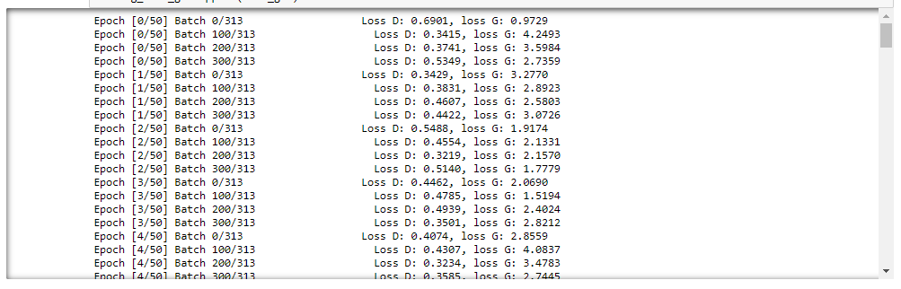
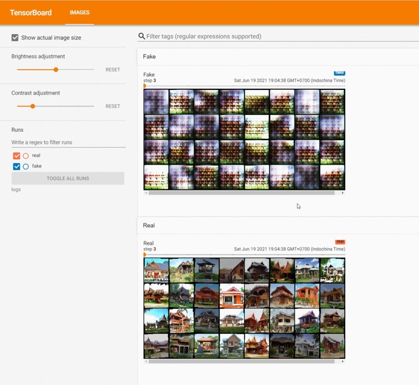
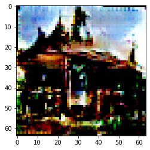
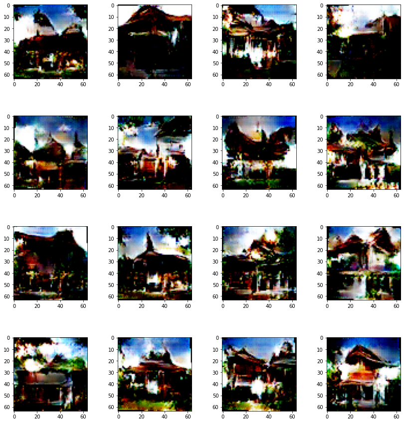
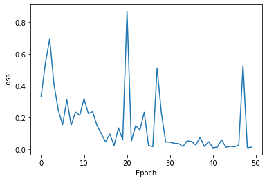
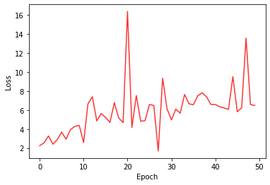

# Thai house generator 🏡

Code adapted from [Aladdin Persson](https://www.youtube.com/channel/UCkzW5JSFwvKRjXABI-UTAkQ).

# Description
This is my project on Deep Learning. It generates traditional thai house images using DCGANs.
Total training images = 1,000 images (10,000 after augmented). The result images are still not good. More training, data, and tuning needed.


# Instructions

### Project structure

```
├───dataset
│   └───[your_dataset]
      └───images
├───gen_img
│   └───[name_your_folder]
├───saved_models
│   └───[name_your_folder]
└───tensorboard_logs
    └───[name_your_folder]
```
### [1] Training
See section 1, 2 in the notebook
- Put training images in `dataset/[your_dataset]/images/`
- Set project path in the notebook
  ```
  DATASET_PATH = "./dataset/[your_dataset]"
  PROJECT_PATH = "[name_your_folder]"
  ```
- Run `Thaihouse-gen_DCGANs.ipynb`
- Weights will be saved every epochs in `saved_models/`
- Tensorboard logs will be in `tensorboard_logs/`

<br>

**Training with 50epochs**

<br>



<br>

**Tensorboard**

<br>



### [3] Inference
See section 3, 4 in the notebook. Generate one random tensor and put into generator.

<br>



<br>



### [3] Loss
See section 5 in the notebook. But as you can see, generator loss is still not converging.

<br>




<br>


